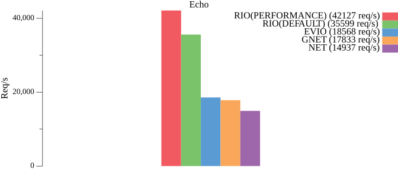

# RIO

基于`IOURING`的`AIO`网络库，非`CGO`方式，且遵循标准库使用设计模式。

支持协议：`TCP`、`UDP`、`UNIX`、`UNIXGRAM`（`IP`为代理标准库）。

`RIO` 是遵循标准库使用方式的，是可以非常方便的投入使用，所以它不是个玩具。

***Linux 内核版本需要`>= 5.19`，推荐版本为`>= 6.6`。***

## 特性
* 基于 `IOURING` 的实现
* 基于 `net.Listener` `net.Conn`  和 `net.PacketConn` 的实现
* 使用批处理方式来减少系统调用的开销
* 支持 `TLS`
* 支持 `FIXED BUFFER` 和 `FIXED FILE`
* 支持 `SEND_ZC` 和 `SENDMSG_ZC`


## 性能



<details>
<summary>详细信息</summary>

使用 `tcpkali` 进行压力测试，[基准测试代码地址](https://github.com/brickingsoft/rio_examples/tree/main/benchmark) 。


环境：

| 端   | 平台      | IP              | OS                                             | 规格     |
|-----|---------|-----------------|------------------------------------------------|--------|
| 客户端 | WSL2    | 192.168.100.1   | Ubuntu22.04 （6.6.36.6-microsoft-standard-WSL2） | 4C 16G |
| 服务端 | Hyper-V | 192.168.100.120 | Ubuntu24.10（6.11.0-8-generic）                  | 4C 8G  |


```shell
tcpkali --workers 1 -c 50 -T 10s -m "PING" 192.168.100.120:9000
```
结果：

| 种类           | 速率 （pps） | 说明       | 性能    |
|--------------|----------|----------|-------|
| RIO(DEFAULT) | 35599.0  | 稳定在35000 | 100 % |
| EVIO         | 18568.5  | 稳定在18000 | 52 %  |
| GNET         | 17832.6  | 稳定在17000 | 50 %  |
| NET          | 14937.1  | 稳定在14000 | 42 %  |

<details>
<summary>明细输出</summary>

```text
------ RIO(DEFAULT) ------
Destination: [192.168.100.120]:9000
Interface eth0 address [192.168.100.1]:0
Using interface eth0 to connect to [192.168.100.120]:9000
Ramped up to 50 connections.
Total data sent:     368.5 MiB (386415368 bytes)
Total data received: 366.7 MiB (384519186 bytes)
Bandwidth per channel: 12.325⇅ Mbps (1540.7 kBps)
Aggregate bandwidth: 307.375↓, 308.891↑ Mbps
Packet rate estimate: 35599.0↓, 26694.1↑ (3↓, 26↑ TCP MSS/op)
Test duration: 10.0078 s.
```

```text
------ EVIO ------
Destination: [192.168.100.120]:9000
Interface eth0 address [192.168.100.1]:0
Using interface eth0 to connect to [192.168.100.120]:9000
Ramped up to 50 connections.
Total data sent:     177.4 MiB (185991168 bytes)
Total data received: 176.0 MiB (184593536 bytes)
Bandwidth per channel: 5.925⇅ Mbps (740.6 kBps)
Aggregate bandwidth: 147.555↓, 148.673↑ Mbps
Packet rate estimate: 18568.5↓, 12776.1↑ (3↓, 44↑ TCP MSS/op)
Test duration: 10.0081 s.
```

```text
------ GNET ------
Destination: [192.168.100.120]:9000
Interface eth0 address [192.168.100.1]:0
Using interface eth0 to connect to [192.168.100.120]:9000
Ramped up to 50 connections.
Total data sent:     176.8 MiB (185401344 bytes)
Total data received: 175.4 MiB (183927028 bytes)
Bandwidth per channel: 5.908⇅ Mbps (738.4 kBps)
Aggregate bandwidth: 147.099↓, 148.278↑ Mbps
Packet rate estimate: 17832.6↓, 12716.7↑ (3↓, 44↑ TCP MSS/op)
Test duration: 10.0029 s.
```

```text
------ NET ------
Destination: [192.168.100.120]:9000
Interface eth0 address [192.168.100.1]:0
Using interface eth0 to connect to [192.168.100.120]:9000
Ramped up to 50 connections.
Total data sent:     198.3 MiB (207945728 bytes)
Total data received: 196.6 MiB (206165284 bytes)
Bandwidth per channel: 6.623⇅ Mbps (827.9 kBps)
Aggregate bandwidth: 164.859↓, 166.282↑ Mbps
Packet rate estimate: 14937.1↓, 14506.0↑ (2↓, 45↑ TCP MSS/op)
Test duration: 10.0045 s.
```

</details>

</details>


## 使用

```shell
go get -u github.com/brickingsoft/rio
```

基本使用，将 `github.com/brickingsoft/rio` 替换 `net`。
```go
// 将 net.Listen() 替换成 rio.Listen() 
ln, lnErr := rio.Listen("tcp", ":9000")
// 将 net.Dial() 替换成 rio.Dial() 
conn, dialErr := rio.Dial("tcp", "127.0.0.1:9000")
```


## 进阶使用

### TLS

使用内置`security`方式。
```go
// server("github.com/brickingsoft/rio/security")
ln, _ = security.Listen("tcp", ":9000", config)

// client("github.com/brickingsoft/rio/security")
conn, _ = security.Dial("tcp", "127.0.0.1:9000", config)
```

使用包裹方式。
```go

// server(use crypto/tls wrap)
ln, _ := rio.Listen("tcp", ":9000")
ln, _ := tls.NewListener(ln, config)

// client(use crypto/tls wrap)
rawConn, dialErr := rio.Dial("tcp", "127.0.0.1:9000")
conn := tls.Client(rawConn, config)
if err := conn.HandshakeContext(ctx); err != nil {
	rawConn.Close()
	return nil, err
}
```

### 类型转换

```go
// 转换成 TCP 链接 
tcpConn, ok := conn.(*rio.TCPConn)
// 转换成 UDP 链接
udpConn, ok := conn.(*rio.UDPConn)
// 转换成 UNIX 链接
unixConn, ok := conn.(*rio.UnixConn)
```


### Pin 与 Unpin

一般用于只有 `Dial` 场景。或者有多个 `Listen` 的场景。

因为单一 `Listen` 的生命周期往往和程序是一致的，所以 `IOURING` 实例的生命周期是与程序是一致的。

而 `Dial` 的生命周期是短的，往往是频繁 `Dial` ，多个 `Listen` 意味着生命周期是与程序是不一致的。

所以需要 `Pin` 和 `Unpin `来 `IOURING` 实例，而不是频繁启停。

```go
// 程序启动位置
err := rio.Pin()
// 程序退出位置
err := rio.Unpin()
```

### Config <a id="config"></a>

`rio.ListenConfig` 与 `net.ListenConfig` 是类似的，通过配置来监听。
```go

config := rio.ListenConfig{
    Control:            nil,                     // 设置控制器
    KeepAlive:          0,                       // 设置 KeepAlive 时长
    KeepAliveConfig:    net.KeepAliveConfig{},   // 设置 KeepAlive 详细配置
    MultipathTCP:       false,                   // 是否多路TCP模式
    FastOpen:           false,                   // 是否快速打开
    QuickAck:           false,                   // 是否快速应答
    ReusePort:          false,                   // 是否重用端口（同时开启cBPF）
    SendZC:             false,                   // 是否使用 Zero-Copy 方式发送（某些场景会遥测不到但其实是发送了，如 TCPKALI）
    MultishotAccept:    false,                   // 是否单投多发模式来接受链接
    AutoFixedFdInstall: false,                   // 是否启用接受到的链接进行自动安装描述符（超出后会退回到非注册模式）
}
ln, lnErr := config.Listen(context.Background(), "tcp", ":9000")
```

`rio.Dialer` 与 `net.Dialer` 是类似的，通过配置来拨号。
```go
dialer := rio.Dialer{
    Timeout:            0,                          // 超时
    Deadline:           time.Time{},                // 死期
    KeepAlive:          0,                          // 设置 KeepAlive 时长
    KeepAliveConfig:    net.KeepAliveConfig{},      // 设置 KeepAlive 详细配置
    LocalAddr:          nil,                        // 本地地址
    MultipathTCP:       false,                      // 是否多路TCP模式
    FastOpen:           false,                      // 是否快速打开
    QuickAck:           false,                      // 是否快速应答
    SendZC:             false,                      // 是否使用 Zero-Copy 方式发送（某些场景会遥测不到但其实是发送了，如 TCPKALI）
    AutoFixedFdInstall: false,                      // 是否启用接受到的链接进行自动安装描述符（超出后会退回到非注册模式）
    Control:            nil,                        // 设置控制器
    ControlContext:     nil,                        // 设置带上下文的控制器
}
conn, dialErr := dialer.DialContext(context.Background(), "tcp", "127.0.0.1:9000")
```

### Fixed Buffer

使用注册的固定字节缓存进行读写，其效果是相比非注册模式会减少字节缓存在映射时上下文切换。

如需使用，请务必设置固定字节缓存在先，可以通过名为`RIO_IOURING_REG_FIXED_BUFFERS`的环境变量或`rio.Presets(aio.WithRegisterFixedBuffer(..))` 方式来设置。

```go
// convert
fixed, ok := rio.ConvertToFixedReaderWriter(conn)
// acquire buf
buf := fixed.AcquireRegisteredBuffer()
defer fixed.ReleaseRegisteredBuffer(buf)
// check buf
if buf == nil {
	// not registered or no buf remain
	// use normal read
}
// read
rn, rErr := buf.ReadFixed(buf)
// write
wn, wErr := fixed.WriteFixed(buf)
```
### Fixed Fd

使用固定描述符进行 IO 操作，其效果是相比非注册模式会减少内核操作 FD 是的上下文切换。

如需使用，请务必设置固定描述符数组大小，可以通过名为`RIO_IOURING_REG_FIXED_FILES`的环境变量或`rio.Presets(aio.WithRegisterFixedFiles(..))` 方式来设置。

自动模式见 [Config](#config)，自动模式下当不够用时会不安装但不会返回错误。

手动安装如下：
```go
// convert
fixed, ok := rio.ConvertToFixedFd(conn)
// install
err := fixed.InstallFixedFd()
```

### 参数设置
通过设置环境变量进行调控，具体详见 [IOURING](https://man7.org/linux/man-pages/man2/io_uring_setup.2.html)。

| 名称                             | 值  | 说明                                                 |
|--------------------------------|----|----------------------------------------------------|
| RIO_IOURING_ENTRIES            | 数字 | 环大小，默认为最大值 16384。                                  |
| RIO_IOURING_SETUP_FLAGS        | 文本 | 标识，如`IORING_SETUP_SQPOLL, IORING_SETUP_SQ_AFF`等。   |
| RIO_IOURING_SETUP_FLAGS_SCHEMA | 文本 | 标识方案，`DEFAULT` 或 `PERFORMANCE`。                    |
| RIO_IOURING_SQ_THREAD_CPU      | 数字 | 设置 SQ 环锁亲和的 CPU。                                   |
| RIO_IOURING_SQ_THREAD_IDLE     | 数字 | 在含有`IORING_SETUP_SQPOLL`标识时，设置空闲时长，单位为毫秒，默认是 10 秒。 |
| RIO_IOURING_REG_FIXED_BUFFERS  | 文本 | 设置注册固定字节缓存，格式为 `单个大小, 个数`， 如`4096, 1024`。          |
| RIO_IOURING_REG_FIXED_FILES    | 数字 | 设置注册固定描述符，当大于软上限时，会使用软上线值。                         |
| RIO_PREP_SQE_BATCH_SIZE        | 数字 | 准备 SQE 的缓冲大小，默认为 1024 的大小。                         |
| RIO_PREP_SQE_BATCH_TIME_WINDOW | 数字 | 准备 SQE 批处理时长，默认 500 纳秒。                            |
| RIO_PREP_SQE_BATCH_IDLE_TIME   | 数字 | 准备 SQE 空闲时长，默认 15 秒。                               |
| RIO_PREP_SQE_BATCH_AFF_CPU     | 数字 | 设置准备 SQE 线程所亲和的 CPU。                               |
| RIO_WAIT_CQE_BATCH_SIZE        | 数字 | 获取 CQE 的批大小，默认为 1024 的大小。                          |
| RIO_WAIT_CQE_BATCH_AFF_CPU     | 布尔 | 设置获取 CQE 线程所亲和的 CPU。                               |
| RIO_WAIT_CQE_BATCH_TIME_CURVE  | 文本 | 设置等待 CQE 策略曲线，如 `1:15s, 8:2us, 16:1ms`。            |

注意事项：
* `RIO_IOURING_SETUP_FLAGS` 与系统内核版本有关联，请务必确认版本，但程序会自动过滤掉与版本不符的标识，但不解决标识冲突。
  * `IORING_SETUP_SQPOLL` 取决于运行环境，非常吃配置，请自行选择配置进行调试。
  * `IORING_SETUP_SQ_AFF` 激活时，且是容器环境，此时需要注意 CPU 的相关设置。
* `RIO_IOURING_SETUP_FLAGS_SCHEMA` 优先级低于 `RIO_IOURING_SETUP_FLAGS` 。
  * `DEFAULT` 为 `IORING_SETUP_COOP_TASKRUN`
  * `PERFORMANCE` 为 `IORING_SETUP_SQPOLL` `IORING_SETUP_SQ_AFF` 和 `IORING_SETUP_SINGLE_ISSUER`，所以非常吃配置，但是会减少系统调用。
* `RIO_IOURING_REG_FIXED_BUFFERS` 为 `rio.FixedReaderWriter` 的前置必要条件，如果使用固定读写，必须设置该变量来注册。
* `RIO_IOURING_REG_FIXED_FILES` 为 `rio.FixedReaderWriter`、`rio.FixedFd` 和 `AutoFixedFdInstall` 的前置必要条件，如果使用固定文件，必须设置该变量来注册。
* `RIO_PREP_SQE_BATCH_IDLE_TIME` 是用来处理忙等待问题，所以值会大一点。
* `RIO_PREP_SQE_BATCH_TIME_WINDOW` 是批处理窗口，过小和过大都会影响性能。
* `RIO_WAIT_CQE_BATCH_TIME_CURVE` 的第一个节点的时长建议大一些，太小会引发忙等待，后续节点会具体影响性能。


