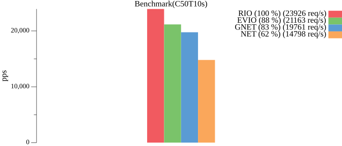
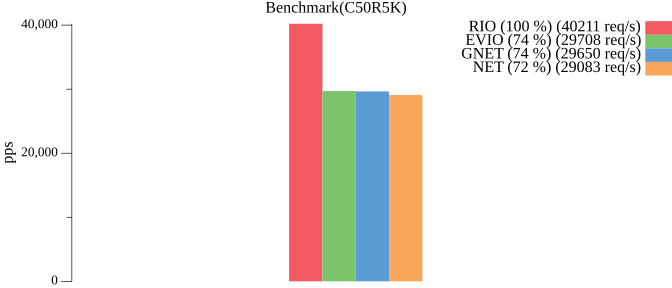
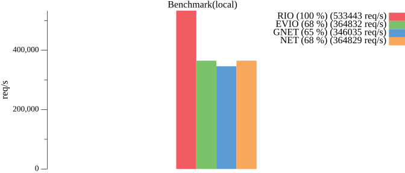

# RIO

基于`IOURING`的`AIO`网络库，非`CGO`方式，且遵循标准库使用设计模式。

支持协议：`TCP`、`UDP`、`UNIX`、`UNIXGRAM`（`IP`为代理标准库）。

`RIO` 是一个遵循标准库使用方式的库，可以非常方便的投入使用，所以它不是个玩具，可以以非常低成本的进行代替`NET`。

## 注意
* 【重要】Linux 内核版本必须`>= 6.13`
* 【重要】只使用 `Dial` 的场景需要 `PIN` 和 `UNPIN` 来固定 `IOURING` 的内核线程
* 【重要】`WSL2` 中不能开启 `networkingMode=mirrored`
* 【普通】因 `DIRECT FD` 不支持 `CLOEXEC` 所以务必在程序退出时关闭所有 `FD` （net.Http 和 fasthttp 均实现关闭时关闭所有链接）


## 特性
* 基于 `net.Listener` `net.Conn` 和 `net.PacketConn` 的实现
* 使用 `BATCH` 来减少 `SYSTEM CALL` 的开销
* 支持 `TLS`
* 支持 `MULTISHOT_ACCEPT` `MULTISHOT_RECV` 和 `MULTISHOT_RECV_MSG`
* 支持 `SEND_ZC` 和 `SENDMSG_ZC`
* 支持 `NAPI`
* 支持 `PERSIONALITY`
* 支持 `CURVE` 进行动态调整 `WAIT CQE` 的超时来适配不同场景


## 性能





<details>
<summary>详细信息</summary>

使用 `tcpkali` 进行压力测试，[基准测试代码地址](https://github.com/brickingsoft/rio_examples/tree/main/benchmark) 。


环境：

| 端   | 平台      | IP              | OS                                           | 规格      |
|-----|---------|-----------------|----------------------------------------------|---------|
| 客户端 | WSL2    | 192.168.100.1   | Ubuntu22.04 （6.13.6-microsoft-standard-WSL2） | 4C 16G  |
| 服务端 | Hyper-V | 192.168.100.120 | Ubuntu24.10（6.11.0-8-generic）                | 4C 0.5G |


### C50 T10s
50链接10秒。

```shell
tcpkali --workers 1 -c 50 -T 10s -m "PING" 192.168.100.120:9000
```
结果：

| 种类   | 速率 （pps） | 说明       | 性能    |
|------|----------|----------|-------|
| RIO  | 23263.3  | 稳定在23000 | 100 % |
| EVIO | 18855.5  | 稳定在18000 | 81 %  |
| GNET | 18284.7  | 稳定在18000 | 79 %  |
| NET  | 14638.6  | 稳定在14000 | 63 %  |


### C50 R5k
50链接重复5000次。

```shell
tcpkali --workers 1 -c 50 -r 5k -m "PING" 192.168.100.120:9000
```
结果：

| 种类   | 速率 （pps） | 说明       | 性能    |
|------|----------|----------|-------|
| RIO  | 44031.1  | 稳定在44000 | 100 % |
| EVIO | 27997.6  | 稳定在28000 | 64 %  |
| GNET | 28817.2  | 稳定在28000 | 65 %  |
| NET  | 27874.5  | 稳定在28000 | 63 %  |


</details>


## 使用

```shell
go get -u github.com/brickingsoft/rio
```

基本使用，将 `github.com/brickingsoft/rio` 替换 `net`。
```go
// 将 net.Listen() 替换成 rio.Listen() 
ln, lnErr := rio.Listen("tcp", ":9000")
// 将 net.Dial() 替换成 rio.Dial() 
conn, dialErr := rio.Dial("tcp", "127.0.0.1:9000")
```

### TLS

使用内置`security`方式。
```go
// server("github.com/brickingsoft/rio/security")
ln, _ = security.Listen("tcp", ":9000", config)

// client("github.com/brickingsoft/rio/security")
conn, _ = security.Dial("tcp", "127.0.0.1:9000", config)
```

使用包裹方式。
```go

// server(use crypto/tls wrap)
ln, _ := rio.Listen("tcp", ":9000")
ln, _ := tls.NewListener(ln, config)

// client(use crypto/tls wrap)
rawConn, dialErr := rio.Dial("tcp", "127.0.0.1:9000")
conn := tls.Client(rawConn, config)
if err := conn.HandshakeContext(ctx); err != nil {
	rawConn.Close()
	return nil, err
}
```

### 类型转换

```go
// 转换成 TCP 链接 
tcpConn, ok := conn.(*rio.TCPConn)
// 转换成 UDP 链接
udpConn, ok := conn.(*rio.UDPConn)
// 转换成 UNIX 链接
unixConn, ok := conn.(*rio.UnixConn)
// 转换成 RIO 链接
rioConn, ok := conn.(rio.Conn)
```


### 配置

`rio.ListenConfig` 与 `net.ListenConfig` 是类似的，通过配置来监听。
```go

config := rio.ListenConfig{
    Control:            nil,                     // 设置控制器
    KeepAlive:          0,                       // 设置 KeepAlive 时长
    KeepAliveConfig:    net.KeepAliveConfig{},   // 设置 KeepAlive 详细配置
    MultipathTCP:       false,                   // 是否多路TCP模式
    ReusePort:          false,                   // 是否重用端口（同时开启cBPF）
}
ln, lnErr := config.Listen(context.Background(), "tcp", ":9000")
```

`rio.Dialer` 与 `net.Dialer` 是类似的，通过配置来拨号。
```go
dialer := rio.Dialer{
    Timeout:            0,                          // 超时
    Deadline:           time.Time{},                // 死期
    KeepAlive:          0,                          // 设置 KeepAlive 时长
    KeepAliveConfig:    net.KeepAliveConfig{},      // 设置 KeepAlive 详细配置
    LocalAddr:          nil,                        // 本地地址
    FallbackDelay:      0,                          // 并行回退延时   
    MultipathTCP:       false,                      // 是否多路TCP模式
    Control:            nil,                        // 设置控制器
    ControlContext:     nil,                        // 设置带上下文的控制器
}
conn, dialErr := dialer.DialContext(context.Background(), "tcp", "127.0.0.1:9000")
```

### PIN AND UNPIN

因 `IOURING` 的设置与关闭过程中有资源处理的步骤，且它的生命周期与使用者的最长生命周期挂钩。

为了防止实例的不该关闭时关闭，可以通过 `PIN` 和 `UNPIN` 来手动控制它的生命周期，一般适用于只有 `DIAL` 或有多个 `LISTEN` 的场景。

```go
// 在预设和发起链接前进行调用
rio.Pin()
// 在所有链接关闭后进行调用
rio.Unpin()
```

### 预设

通过预设来定制化 `IOURING`。

```go
// 设置 EventLoop 数量，一个 EventLoop 持有一个 IOURING 实例。
// 并不推荐多个 IOURING 实例，除非 CPU 资源十分富裕。
// 如需要多个 IOURING 实例，可以使用 REUSE PORT 来进行多进程实现多个实例。
rio.Peset(aio.WithEventLoopCount(1))
// 设置 IOURING 的大小，默认是16384，最大是32768。
rio.Peset(aio.WithEntries(liburing.DefaultEntries))
// 设置 IOURING 的 Flags。
// 默认已对单线程进行优化，如何需要开启 SQPOLL，可以进行设置。
rio.Peset(aio.WithFlags(liburing.IORING_SETUP_SINGLE_ISSUER))
// 是否开启 SEND ZERO COPY。
// 默认未开启。
rio.Peset(aio.WithSendZCEnabled(false))
// 是否禁止多射模式。
// 默认未禁止。
// 多射可以大幅减少 SQE 的投递，但会需要额外的资源。
// 禁止多射模式一般用于配合开启 SQPOLL 来大幅减少 SYSCALL 的开销。
rio.Peset(aio.WithMultishotDisabled(false))
// 配置 Buffer and Ring。
// 非禁止多射模式有效。
// 一个 Buffer and Ring 只服务于一个 Fd。
// 参数 size 是 buffer 的大小，建议是一个 page size。
// 参数 count 是指有多少个 buffer。
// 参数 idle timeout 是指当不再被使用后，空闲多少时间再注销。
rio.Peset(aio.WithBufferAndRingConfig(4096, 32, 2*time.Second))
// 设置 CQE 等待时间曲线。
// 预设有 aio.SCurve（默认） 和 aio.LCurve 。
// 更短的时间有利于更低的延时，如 SCurve 适合 HTTP。
// 更长的时间有利于更大的批处理，如 LCurve 适合 EVENT MESSAGE。
rio.Peset(aio.WithWaitCQETimeoutCurve(aio.SCurve))
// 设置 NAPI。
// 默认未开启。
rio.Peset(aio.WithNAPIBusyPollTimeout(50*time.Microsecond))
```


