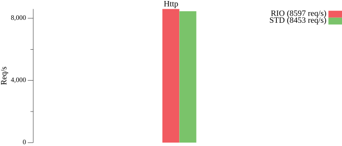

# RIO

基于`IOURING`的`AIO`网络库，非`CGO`方式，且遵循标准库使用设计模式。

支持协议：`TCP`、`UDP`、`UNIX`、`UNIXGRAM`（`IP`为代理标准库）。

Linux 内核版本需要`>= 5.14`，推荐版本为`>= 6.1`。

## 性能
测试环境：Win11（WSL2）、内核（6.6.36.6-microsoft-standard-WSL2）、CPU（13600K）。

基于默认参数的测试，10线程，每线程1000链接，共计10000链接。

RIO 相比 STD（标准库）约快13%，详见 [Benchmark](https://github.com/brickingsoft/rio_examples/tree/main/benchmark) 。

注意：CurveWaitTransmission 在不同环境下的性能体现是不同的，需按需调整来发挥出高效的性能。 




```text
------ Benchmark ------
Port: 9000
Workers: 10
Count: 1000
NBytes: 1024
ECHO-RIO benching complete(1.564700361s): 6391 conn/sec, 6.2M inbounds/sec, 6.2M outbounds/sec, 0 failures
ECHO-STD benching complete(1.821161901s): 5491 conn/sec, 5.4M inbounds/sec, 5.4M outbounds/sec, 0 failures
HTTP-RIO benching complete(1.722059583s): 5807 conn/sec, 5.8M inbounds/sec, 5.8M outbounds/sec, 0 failures
HTTP-STD benching complete(1.948937829s): 5131 conn/sec, 5M inbounds/sec, 5M outbounds/sec, 0 failures
```
## 使用

```shell
go get -u github.com/brickingsoft/rio
```

基本使用`rio`替换`net`：
```go

// 将 net.Listen() 替换成 rio.Listen() 
ln, lnErr := rio.Listen("tcp", ":9000")
// 将 net.Dial() 替换成 rio.Dial() 
conn, dialErr := rio.Dial("tcp", "127.0.0.1:9000")

```

TLS场景：
```go
// server("github.com/brickingsoft/rio/tls")
ln, _ = tls.Listen("tcp", "127.0.0.1:9000", tls.ConfigFrom(config))
// server(use wrap)
ln, _ := rio.Listen("tcp", ":9000")
ln, _ := tls.NewListener(ln, config)

// client("github.com/brickingsoft/rio/tls")
conn, _ = tls.Dial("tcp", "127.0.0.1:9000", tls.ConfigFrom(config))

// client(use wrap)
rawConn, dialErr := rio.Dial("tcp", "127.0.0.1:9000")
conn := tls.Client(rawConn, config)
if err := conn.HandshakeContext(ctx); err != nil {
	rawConn.Close()
	return nil, err
}
```

转换场景：
```go
// tcp sendfile
reader, ok := conn.(io.ReaderFrom)
// 转换成 TCP 链接 
tcpConn, ok := conn.(*rio.TCPConn)
// 转换成 UDP 链接
udpConn, ok := conn.(*rio.UDPConn)
// 转换成 UNIX 链接
unixConn, ok := conn.(*rio.UnixConn)
```

纯客户端场景：

建议`PIN`住`IOURING`，直到程序退出再`UNPIN`。

因为`IOURING`的生命周期为当被使用时开启，当被没有被使用时关闭。

因为`Listen`的生命周期往往和程序是一致的，所以`IOURING`为常驻状况。

而`Dial`的生命周期是短的，往往是频繁`Dial`，所以需要`PIN`来常驻`IOURING`，而不是频繁启停。
```go
// 程序启动位置
rio.Pin()
// 程序退出位置
rio.Unpin()
```

HTTP场景：

Server 使用`Listener`代替法。

Client 使用`RoundTripper`代替法。
```go
// http server
http.Serve(ln, handler)
// fasthttp server
fasthttp.Serve(ln, handler)
```

REUSE PORT（监听TCP时自动启用）：

```go

lc := rio.ListenConfig{}
lc.SetReusePort(true)

ln, lnErr := lc.Listen(...)

```

## 进阶调参

```go
//go:build linux
package main

import (
    "github.com/brickingsoft/rio"
)


func setup() {
	// 设置进程等级
	rio.UseProcessPriority()
	// 设置 IOURING 的大小
	rio.UseEntries()
	// 设置 IOURING 的 Flags
	rio.UseFlags()
	// 设置 IOURING 的 Features
	rio.UseFeatures()
	// 设置IOURING个数
	// 不是越多越好，与 CPU 数量相关，默认是 CPU 数量的1/4。
	rio.UseVortexNum(1)
	// 设置IOURING加载平衡器
	rio.UseLoadBalancer()
	// 设置任务准备批大小
	// 默认是任务数
	rio.UsePrepareBatchSize()
	// 设置完成事件等待变速器构建器
	// 这与性能息息相关，调整变速器实现不同的性能。
	// 默认是曲线变速器，
	rio.UseWaitTransmissionBuilder() 
	// 设置从可读方读数据策略
	rio.UseReadFromFilePolicy()
	// 使用爆操性能模式
	rio.UsePreformMode()
}

```

