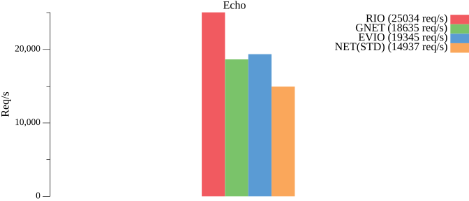

# RIO

基于`IOURING`的`AIO`网络库，非`CGO`方式，且遵循标准库使用设计模式。

支持协议：`TCP`、`UDP`、`UNIX`、`UNIXGRAM`（`IP`为代理标准库）。

Linux 内核版本需要`>= 5.14`，推荐版本为`>= 6.1`。

## 性能

使用 `tcpkali` 进行压力测试，
[基准测试代码地址](https://github.com/brickingsoft/rio_examples/tree/main/benchmark) 。

```shell
tcpkali --workers 1 -c 50 -T 10s -m "PING" 192.168.100.120:9000
```

| 端   | 平台      | IP              | OS                                             | 规格     |
|-----|---------|-----------------|------------------------------------------------|--------|
| 客户端 | WSL2    | 192.168.100.1   | Ubuntu22.04 （6.6.36.6-microsoft-standard-WSL2） | 4C 16G |
| 服务端 | Hyper-V | 192.168.100.120 | Ubuntu24.10（6.11.0-8-generic）                  | 4C 8G  |




| 种类       | 速率 （pps） | 说明       | 性能    |
|----------|----------|----------|-------|
| RIO      | 25033.5  | 稳定在25000 | 100 % |
| GNET     | 18635.1  | 稳定在18000 | 74 %  |
| EVIO     | 19344.9  | 稳定在19000 | 77 %  |
| NET(STD) | 14937.1  | 稳定在14000 | 59 %  |

<details>
<summary>详细结果</summary>

```text
------ RIO ------
Destination: [192.168.100.120]:9000
Interface eth0 address [192.168.100.1]:0
Using interface eth0 to connect to [192.168.100.120]:9000
Ramped up to 50 connections.
Total data sent:     265.5 MiB (278387192 bytes)
Total data received: 264.1 MiB (276937819 bytes)
Bandwidth per channel: 8.879⇅ Mbps (1109.8 kBps)
Aggregate bandwidth: 221.386↓, 222.544↑ Mbps
Packet rate estimate: 25033.5↓, 19456.6↑ (3↓, 31↑ TCP MSS/op)
Test duration: 10.0074 s.
```

```text
------ GNET ------
Destination: [192.168.100.120]:9000
Interface eth0 address [192.168.100.1]:0
Using interface eth0 to connect to [192.168.100.120]:9000
Ramped up to 50 connections.
Total data sent:     185.6 MiB (194641920 bytes)
Total data received: 183.8 MiB (192732708 bytes)
Bandwidth per channel: 6.074⇅ Mbps (759.3 kBps)
Aggregate bandwidth: 154.127↓, 155.654↑ Mbps
Packet rate estimate: 18635.1↓, 13607.3↑ (3↓, 45↑ TCP MSS/op)
Test duration: 10.0038 s.
```

```text
------ EVIO ------
Destination: [192.168.100.120]:9000
Interface eth0 address [192.168.100.1]:0
Using interface eth0 to connect to [192.168.100.120]:9000
Ramped up to 50 connections.
Total data sent:     183.4 MiB (192282624 bytes)
Total data received: 181.9 MiB (190755004 bytes)
Bandwidth per channel: 6.123⇅ Mbps (765.3 kBps)
Aggregate bandwidth: 152.457↓, 153.678↑ Mbps
Packet rate estimate: 19344.9↓, 13442.1↑ (3↓, 45↑ TCP MSS/op)
Test duration: 10.0096 s.
```

```text
------ NET ------
Destination: [192.168.100.120]:9000
Interface eth0 address [192.168.100.1]:0
Using interface eth0 to connect to [192.168.100.120]:9000
Ramped up to 50 connections.
Total data sent:     198.3 MiB (207945728 bytes)
Total data received: 196.6 MiB (206165284 bytes)
Bandwidth per channel: 6.623⇅ Mbps (827.9 kBps)
Aggregate bandwidth: 164.859↓, 166.282↑ Mbps
Packet rate estimate: 14937.1↓, 14506.0↑ (2↓, 45↑ TCP MSS/op)
Test duration: 10.0045 s.
```
</details>

## 使用

```shell
go get -u github.com/brickingsoft/rio
```

基本使用`rio`替换`net`：
```go

// 将 net.Listen() 替换成 rio.Listen() 
ln, lnErr := rio.Listen("tcp", ":9000")
// 将 net.Dial() 替换成 rio.Dial() 
conn, dialErr := rio.Dial("tcp", "127.0.0.1:9000")

```

TLS场景：
```go
// server("github.com/brickingsoft/rio/tls")
ln, _ = tls.Listen("tcp", "127.0.0.1:9000", tls.ConfigFrom(config))
// server(use wrap)
ln, _ := rio.Listen("tcp", ":9000")
ln, _ := tls.NewListener(ln, config)

// client("github.com/brickingsoft/rio/tls")
conn, _ = tls.Dial("tcp", "127.0.0.1:9000", tls.ConfigFrom(config))

// client(use wrap)
rawConn, dialErr := rio.Dial("tcp", "127.0.0.1:9000")
conn := tls.Client(rawConn, config)
if err := conn.HandshakeContext(ctx); err != nil {
	rawConn.Close()
	return nil, err
}
```

转换场景：
```go
// tcp sendfile
reader, ok := conn.(io.ReaderFrom)
// 转换成 TCP 链接 
tcpConn, ok := conn.(*rio.TCPConn)
// 转换成 UDP 链接
udpConn, ok := conn.(*rio.UDPConn)
// 转换成 UNIX 链接
unixConn, ok := conn.(*rio.UnixConn)
```

纯客户端场景：

建议`PIN`住`IOURING`，直到程序退出再`UNPIN`。

因为`IOURING`的生命周期为当被使用时开启，当被没有被使用时关闭。

因为`Listen`的生命周期往往和程序是一致的，所以`IOURING`为常驻状况。

而`Dial`的生命周期是短的，往往是频繁`Dial`，所以需要`PIN`来常驻`IOURING`，而不是频繁启停。
```go
// 程序启动位置
rio.Pin()
// 程序退出位置
rio.Unpin()
```

HTTP场景：

Server 使用`Listener`代替法。

Client 使用`RoundTripper`代替法。
```go
// http server
http.Serve(ln, handler)
// fasthttp server
fasthttp.Serve(ln, handler)
```

REUSE PORT（监听TCP时自动启用）：

```go

lc := rio.ListenConfig{}
lc.SetReusePort(true)

ln, lnErr := lc.Listen(...)

```

FIXED READ AND WRITE：

使用注册的`BUFFER`进行读写，这会减少用户与内核之间的切换。

必须设置`IOURING_REG_BUFFERS`环境变量来注册`BUFFER`，详细见`进阶调参`。


```go
frw, ok := rio.Fixed(conn)
if !ok {
	// handle err
}

b := make([]byte, 1024)
buf := frw.AcquireRegisteredBuffer()

// read
rn, rErr := frw.ReadFixed(buf)
// check err
_, _ = buf.Read(b[:rn]) // read into b

// write
buf.Reset() // reset is good

_, _ = buf.Write(b[:rn]) // write into buffer
wn, wErr := frw.WriteFixed(buf)
// check err

frw.ReleaseRegisteredBuffer(buf)

```

## 进阶调参
通过设置环境变量进行调控，具体详见 [IOURING](https://man7.org/linux/man-pages/man2/io_uring_setup.2.html)。

| 名称                         | 值  | 说明                                                   |
|----------------------------|----|------------------------------------------------------|
| IOURING_ENTRIES            | 数字 | 环大小，默认为最大值 16384。                                    |
| IOURING_SETUP_FLAGS        | 文本 | 标识，如`IORING_SETUP_SQPOLL, IORING_SETUP_SUBMIT_ALL`等。 |
| IOURING_SETUP_FLAGS_SCHEMA | 文本 | 标识方案，`DEFAULT` 或 `PERFORMANCE`。                      |
| IOURING_SQ_THREAD_CPU      | 数字 | 设置环锁亲和的CPUID。                                        |
| IOURING_SQ_THREAD_IDLE     | 数字 | 在含有`IORING_SETUP_SQPOLL`标识时，设置空闲时长，单位为毫秒，默认是 1 毫秒。   |
| IOURING_PREPARE_BATCH_SIZE | 数字 | 准备 SQE 的缓冲大小，默认为 SQ 的大小。                             |
| IOURING_USE_CPU_AFFILIATE  | 布尔 | 是否使用 CPU AFFILIATE。                                  |
| IOURING_CURVE_TRANSMISSION | 文本 | 设置等待 CQ 策略曲线，如 `1:1us, 8:2us`。                       |
| IOURING_REG_BUFFERS        | 文本 | 设置等待注册字节缓冲，格式为 `单个大小, 个数`， 如`1024, 100`。             |

注意事项：
* `IOURING_SETUP_FLAGS` 与系统内核版本有关联，请务必确认版本。
* `IORING_SETUP_SQPOLL` 取决于运行环境，非常吃配置，请自行选择配置进行调试。
* `IOURING_SETUP_FLAGS_SCHEMA` 优先级低于 `IOURING_SETUP_FLAGS` 。
* `PERFORMANCE` 为 `IORING_SETUP_SQPOLL` `IORING_SETUP_SINGLE_ISSUER` 的组合。
* `DEFAULT` 为 `0`。


