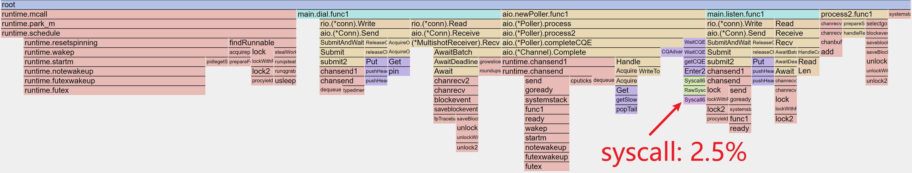
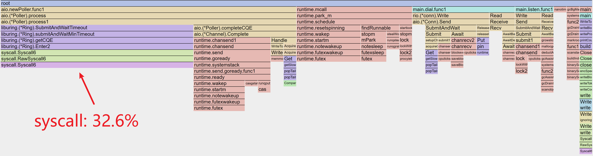
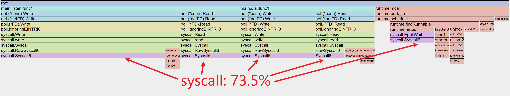

# RIO ([EN](https://github.com/brickingsoft/rio/tree/main/README.md))

基于`IOURING`的`AIO`网络库，非`CGO`方式，且遵循标准库使用设计模式。

支持协议：`TCP`、`UDP`、`UNIX`、`UNIXGRAM`（`IP`为代理标准库）。

`RIO` 是一个遵循标准库使用方式的库，可以非常方便的投入使用，所以它不是个玩具，可以以非常低成本的进行代替`NET`。

## 注意
* 【重要】Linux 内核版本必须`>= 6.13`
* 【重要】只使用 `Dial` 的场景需要 `PIN` 和 `UNPIN` 来固定 `IOURING` 的内核线程
* 【重要】`WSL2` 中不能开启 `networkingMode=mirrored`
* 【普通】因 `DIRECT FD` 不支持 `CLOEXEC` 所以务必在程序退出时关闭所有 `FD` （net.Http 和 fasthttp 均实现关闭时关闭所有链接）


## 特性
* 基于 `net.Listener` `net.Conn` 和 `net.PacketConn` 的实现
* 使用 `BATCH` 来减少 `SYSTEM CALL` 的开销
* 支持 `TLS`
* 支持 `MULTISHOT_ACCEPT` `MULTISHOT_RECV` 和 `MULTISHOT_RECV_FROM`
* 支持 `SEND_ZC` 和 `SENDMSG_ZC`
* 支持 `NAPI`
* 支持 `PERSIONALITY`
* 支持 `CURVE` 进行动态调整 `WAIT CQE` 的超时来适配不同场景


## [性能](https://github.com/brickingsoft/rio_examples/tree/main/benchmark)

***TCP***


***HTTP***


| 端   | 平台      | IP              | OS                                           | 规格      |
|-----|---------|-----------------|----------------------------------------------|---------|
| 客户端 | WSL2    | 192.168.100.1   | Ubuntu22.04 （6.13.6-microsoft-standard-WSL2） | 4C 16G  |
| 服务端 | Hyper-V | 192.168.100.120 | Ubuntu24.10（6.13.12-061312-generic）          | 4C 0.5G |


***Syscall***







| Lib | 占比       | 描述                            |
|-----|----------|-------------------------------|
| RIO | 33% (3%) | 33% 是单一发布者模式，3% 是 SQ_POLL 模式。 |
| NET | 74%      | 读、写、Epoll等合计 74%。             | 


## 使用

```shell
go get -u github.com/brickingsoft/rio
```

基本使用，将 `github.com/brickingsoft/rio` 替换 `net`。
```go
// 将 net.Listen() 替换成 rio.Listen() 
ln, lnErr := rio.Listen("tcp", ":9000")
// 将 net.Dial() 替换成 rio.Dial() 
conn, dialErr := rio.Dial("tcp", "127.0.0.1:9000")
```

### TLS

使用内置`security`方式。
```go
// server("github.com/brickingsoft/rio/security")
ln, _ = security.Listen("tcp", ":9000", config)

// client("github.com/brickingsoft/rio/security")
conn, _ = security.Dial("tcp", "127.0.0.1:9000", config)
```

使用包裹方式。
```go

// server(use crypto/tls wrap)
ln, _ := rio.Listen("tcp", ":9000")
ln, _ := tls.NewListener(ln, config)

// client(use crypto/tls wrap)
rawConn, dialErr := rio.Dial("tcp", "127.0.0.1:9000")
conn := tls.Client(rawConn, config)
if err := conn.HandshakeContext(ctx); err != nil {
	rawConn.Close()
	return nil, err
}
```

### 类型转换

```go
// 转换成 TCP 链接 
tcpConn, ok := conn.(*rio.TCPConn)
// 转换成 UDP 链接
udpConn, ok := conn.(*rio.UDPConn)
// 转换成 UNIX 链接
unixConn, ok := conn.(*rio.UnixConn)
// 转换成 RIO 链接
rioConn, ok := conn.(rio.Conn)
```

### HTTP

```go
rio.Preset(
    aio.WithNAPIBusyPollTimeout(time.Microsecond * 50),
)
ln, lnErr := rio.Listen("tcp", ":9000")
if lnErr != nil {
    panic(lnErr)
    return
}

srv := &http.Server{
    Handler: http.HandlerFunc(func(w http.ResponseWriter, r *http.Request) {
        w.Header().Set("Content-Type", "text/html; charset=utf-8")
        w.WriteHeader(http.StatusOK)
        _, _ = w.Write([]byte("hello world"))
    }),
}

done := make(chan struct{}, 1)
go func(ln net.Listener, srv *http.Server, done chan<- struct{}) {
    if srvErr := srv.Serve(ln); srvErr != nil {
        if errors.Is(srvErr, http.ErrServerClosed) {
            close(done)
            return
        }
        panic(srvErr)
        return
    }
	close(done)
}(ln, srv, done)

signalCh := make(chan os.Signal, 1)
signal.Notify(signalCh, syscall.SIGINT, syscall.SIGKILL, syscall.SIGQUIT, syscall.SIGABRT, syscall.SIGTERM)
<-signalCh

if shutdownErr := srv.Shutdown(context.Background()); shutdownErr != nil {
    panic(shutdownErr)
}
<-done
```


### 配置

`rio.ListenConfig` 与 `net.ListenConfig` 是类似的，通过配置来监听。

如果需要 `KEEP-ALIVE` ，使用 `rio.ListenConfig` 进行设置。
```go

config := rio.ListenConfig{
    Control:            nil,                     // 设置控制器
    KeepAlive:          0,                       // 设置 KeepAlive 时长
    KeepAliveConfig:    net.KeepAliveConfig{},   // 设置 KeepAlive 详细配置
    MultipathTCP:       false,                   // 是否多路TCP模式
    ReusePort:          false,                   // 是否重用端口（同时开启cBPF）
}
ln, lnErr := config.Listen(context.Background(), "tcp", ":9000")
```

`rio.Dialer` 与 `net.Dialer` 是类似的，通过配置来拨号。

如果需要 `KEEP-ALIVE` ，使用 `rio.Dialer` 进行设置。
```go
dialer := rio.Dialer{
    Timeout:            0,                          // 超时
    Deadline:           time.Time{},                // 死期
    KeepAlive:          0,                          // 设置 KeepAlive 时长
    KeepAliveConfig:    net.KeepAliveConfig{},      // 设置 KeepAlive 详细配置
    LocalAddr:          nil,                        // 本地地址
    FallbackDelay:      0,                          // 并行回退延时   
    MultipathTCP:       false,                      // 是否多路TCP模式
    Control:            nil,                        // 设置控制器
    ControlContext:     nil,                        // 设置带上下文的控制器
}
conn, dialErr := dialer.DialContext(context.Background(), "tcp", "127.0.0.1:9000")
```

### PIN 和 UNPIN

因 `IOURING` 的设置与关闭过程中有资源处理的步骤，且它的生命周期与使用者的最长生命周期挂钩。

为了防止实例的不该关闭时关闭，可以通过 `PIN` 和 `UNPIN` 来手动控制它的生命周期，一般适用于只有 `DIAL` 或有多个 `LISTEN` 的场景。

```go
// 在预设和发起链接前进行调用
rio.Pin()
// 在所有链接关闭后进行调用
rio.Unpin()
```

### 完成事件等待曲线

已预设 `aio.NCurve` `aio.SCurve` 和 `aio.LCurve`。


| 曲线     | 描述  | 场景           |  
|--------|-----|--------------|
| NCurve | 空曲线 | 只适用于非单发布者    | 
| SCurve | 短曲线 | 适用于单发布者下的短链接 | 
| LCurve | 长曲线 | 适用于多发布者下的长链接 | 


### 预设

通过预设来定制化 `IOURING`。

```go
rio.Peset(
    // 设置 IOURING 的大小，默认是16384，最大是32768。
    aio.WithEntries(liburing.DefaultEntries),
    // 设置 IOURING 的 Flags。
    // 默认已对单线程进行优化，如何需要开启 SQPOLL，可以进行设置。
    aio.WithFlags(liburing.IORING_SETUP_SINGLE_ISSUER),
    // 是否开启 SEND ZERO COPY。
    // 默认未开启。注意：部分压测工具无法探测到回值。
    aio.WithSendZCEnabled(false),
    // 是否禁止多射模式。
    // 默认未禁止。
    // 多射可以大幅减少 SQE 的投递，但会需要额外的资源，如注册和注销 BufferAndRing。
    // 禁止多射模式一般用于配合开启 SQPOLL 来大幅减少 SYSCALL 的开销。
    aio.WithMultishotDisabled(false),
    // 配置 BufferAndRing。
    // 非禁止多射模式下有效。
    // 一个 BufferAndRing 只服务于一个 Fd。
    // 参数 size 是 buffer 的大小，建议是一个 page size。
    // 参数 count 是指 ring 里有多少个 buffer 节点。
    // 参数 idle timeout 是指当不再被使用后，空闲多少时间再注销。
    aio.WithBufferAndRingConfig(4096, 32, 5*time.Second),
    // 设置 CQE 等待时间曲线。
    aio.WithWaitCQETimeoutCurve(aio.SCurve),
    // 设置 NAPI。
    // 超时时间最小单位为微妙，默认未开启。
    aio.WithNAPIBusyPollTimeout(50*time.Microsecond),
)
```
